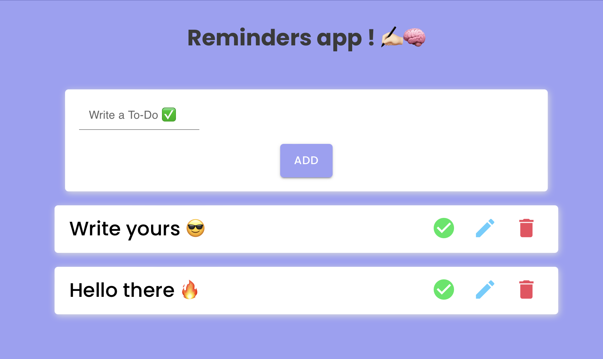

# To-Do app with React.js and Firebase & MaterialUI

## View [here](https://eliazonta.github.io/to-do-app/)

This project is powered by [React.js](https://reactjs.org) & [Firebase](https://firebase.google.com) + [Material UI](https://mui.com)

## Preview

## Run the project locally
1. clone the repo
2. open the terminal and navigate to che cloned directory
3. run `npm i firebase`
4. run `npm start`

